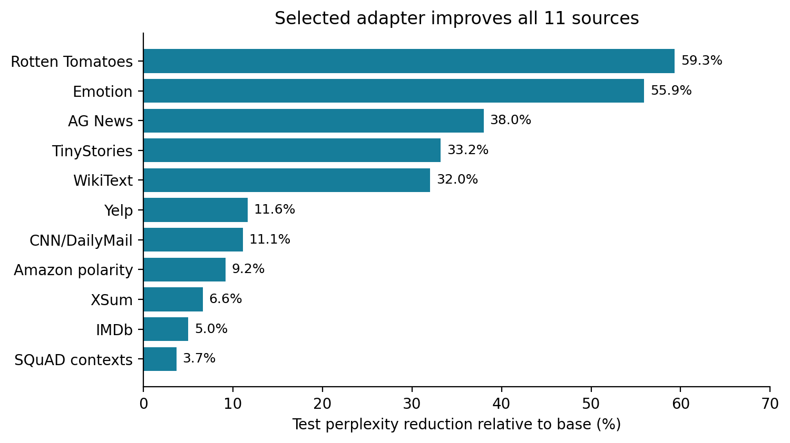

# Pythia-410M LoRA: fine-tuning, evaluation and performance analysis

A reproducible Colab/T4 workflow for next-token adaptation on 11 curated Hugging Face text datasets, with PEFT/LoRA, W&B tracking, checkpoint recovery and inference benchmarking.

## Results

| Configuration | Best validation PPL |
|---|---:|
| Base | 22.310750 |
| Rank 8, LR 1e-4 | 19.482984 |
| Rank 16, LR 1e-4 | 19.282668 |
| Rank 16, LR 5e-4 (selected) | **19.093474** |

The validation-selected adapter reduces **test perplexity from 23.113408 to 19.658658 (14.95%)**, improving all 11 sources. Test results cover 244,760 targets. All 72 benchmark combinations completed. Batch size increases aggregate throughput; FP16 autocast was slower than FP32 in this implementation, which retains FP32 weights and unmerged adapters.

[Research report (PDF)](report/report.pdf) · [Methodology and reproducibility](documentation.md) · [Analysis notebook](notebooks/analysis.ipynb) · [W&B project](https://wandb.ai/daveyash1218-dwarkadas-j-sanghvi-college-of-engineering/slm-lora-performance-analysis)



## Reproduce analysis (no GPU)

```bash
python -m pip install -r requirements-analysis.txt
python scripts/analyze_results.py
```

Original JSON artifacts are preserved under `results/final_test/` and `results/inference_benchmarks/`. The script validates counts, case coverage, repeat measurements and derived metrics, then regenerates figures/tables and checksums. One training seed and four benchmark prompt documents limit generalization; see the report.

## Training and evaluation

Install a suitable PyTorch build first; retain Colab's CUDA installation. Then:

```bash
python -m pip install -r requirements.txt
python -m pytest -q
```

Authenticate W&B interactively. Follow [documentation.md](documentation.md) for training/recovery and [documentation.md](documentation.md) for test evaluation and benchmark commands. Store data/checkpoints in Drive. Do not commit credentials, raw datasets or weights. Completed experiments need not be rerun for analysis.

## Organization

- `configs/`, `experiments/`: shared settings and experiment overrides.
- `src/data/`, `src/training/`, `src/evaluation/`, `src/inference/`, `src/utils/`: modular implementation.
- `tests/`: data, metric, checkpoint/recovery and final-stage checks.
- `scripts/`, `notebooks/`: execution, export and reproducible analysis.
- `results/`: original small artifacts, derived tables and figures.
- `report/`: LaTeX source, bibliography, figure assets and compiled PDF.

No short rank-16 or sequence-1024 training result is claimed; unused templates have been removed. Length comparisons in the final results concern inference prompts. The editable Overleaf link and archival training-history export are tracked in [documentation.md](documentation.md).

[Complete reproduction commands](REPRODUCE.md) · [Methods and results](documentation.md)
